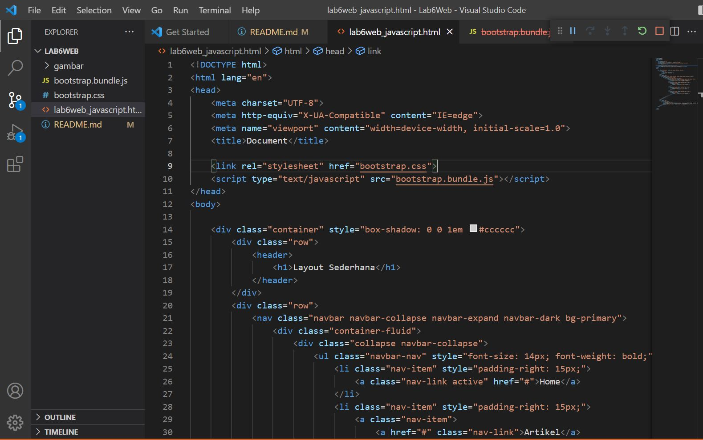
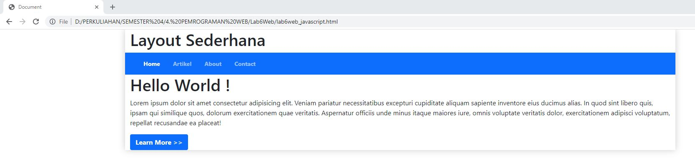

# Lab6Web
## Tugas Pemrograman web - Pertemuan Ke 7

Nama    : Rudi Hartono

NIM     : 312010027

Kelas   : TI.20.B1

*Pada kesempatan kali ini (Perkuliahan Pemrograman Web Pertemuan 7), mahasiswa ditugaskan untuk membuat sebuah layout seperti pada Pertemuan 5 lalu, tetapi membuat dengan menggunakan Twitter Bootstrap. Dimana Website tersebut bisa menjadi responsive atau mengikuti semua device yang dipakai oleh user.*

## Membuat Header dan Hero

*Pertama-tama kita akan membuat halaman baru dengan nama "index.html" di mana dalam sebuah file tersebut sudah dimasukan file Bootstrap & Javascript yang ada.*

*Source code yang saya masukan pada file "index.html" seperti berikut ini:*

*Dan hasil dari source code tersebut akan menampilkan output pada browser seperti gambar dibawah ini.*

