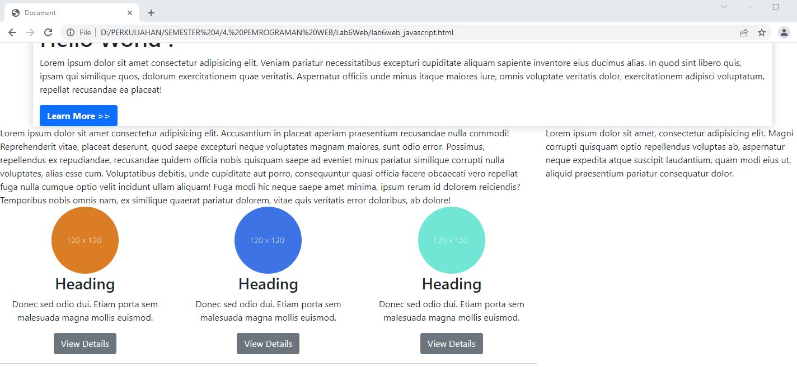

# Lab6Web
## Tugas Pemrograman web - Pertemuan Ke 7

Nama    : Rudi Hartono

NIM     : 312010027

Kelas   : TI.20.B1

*Pada kesempatan kali ini (Perkuliahan Pemrograman Web Pertemuan 7), mahasiswa ditugaskan untuk membuat sebuah layout seperti pada Pertemuan 5 lalu, tetapi membuat dengan menggunakan Twitter Bootstrap. Dimana Website tersebut bisa menjadi responsive atau mengikuti semua device yang dipakai oleh user.*

## Membuat Header dan Hero

*Pertama-tama kita akan membuat halaman baru dengan nama "index.html" di mana dalam sebuah file tersebut sudah dimasukan file Bootstrap & Javascript yang ada.*

*Source code yang saya masukan pada file "index.html" seperti berikut ini:*

*Dan hasil dari source code tersebut akan menampilkan output pada browser seperti gambar dibawah ini.*

## Membuat 2 Kolom Berisi Heading dan Widget Header

*Untuk Point ini saya akan membuat baris baru menggunakan "
" Menjadi Dua Bagian, Dimana sisi saya bagi dari 8 kolom dan sisi kanan 4 kolom.
Seperti contoh pada gambar berikut ini:*

*Lalu dari hasil tampilan pada web nya akan seperti gambar di bawah ini:*

*Setelah Layout coloumns yang saya buat sesuai, saya akan memesukan gambar yang berisi Heading & Tombol. Beberapa source code yang saya tambahkan sebagai berikut:*

*Dan hasil nya pada web akan seperti gambar di bawah ini:*

## Membuat konten Artikel

*Kali ini saya akan membuat content article menggunakan bootstrap. dimana setiap artikel yang ditambahkan akan ada foto di sisi kiri dan kanan. Saya akan menambahkan beberapa source code untuk content article.*

